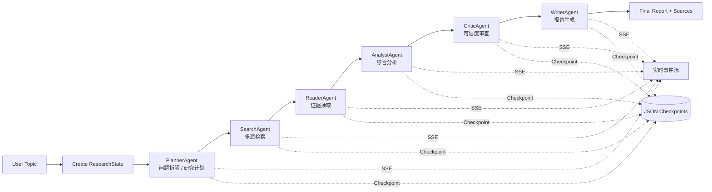
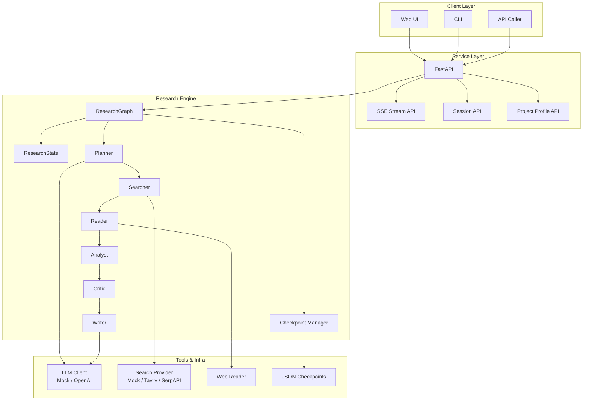

<div align="center">


# 🔎 DeepResearch Multi-Agent System

**一个面向复杂研究任务的多 Agent 深度研究系统**  
把一次性问答升级为 **“规划 → 检索 → 阅读 → 分析 → 审查 → 写作”** 的可观测长链路工作流。

<p>
  
  
  
  
  
  
</p>


**解决复杂研究任务中的资料分散、长链路不可控、答案不可追溯、过程黑盒与任务中断难恢复等问题。**

</div>


## ✨ 项目亮点

- **多 Agent 协作**：Planner / Searcher / Reader / Analyst / Critic / Writer 六阶段闭环
- **长链路研究编排**：不是一次性回答，而是可拆解、可检查、可恢复的研究流程
- **SSE 实时流式输出**：实时看到每个 Agent 正在做什么
- **Checkpoint 恢复**：任务中断后可从上一步继续
- **可插拔基础设施**：支持 Mock / OpenAI / Tavily / SerpAPI，便于本地开发和后续扩展
- **GitHub 友好展示**：适合用于项目展示、面试讲解、技术汇报


## 📌 项目解决的核心痛点

<table>
  <tr>
    <th>核心痛点</th>
    <th>问题表现</th>
    <th>系统方案</th>
  </tr>
  <tr>
    <td><b>资料分散，人工检索成本高</b></td>
    <td>网页、PDF、知识库、行业报告分散，人工检索和整理链路长</td>
    <td><b>Planner + Searcher + Reader</b> 自动完成问题拆解、多源检索和证据抽取</td>
  </tr>
  <tr>
    <td><b>复杂问题难以一次回答清楚</b></td>
    <td>单次 Prompt 容易遗漏子问题，缺乏过程控制</td>
    <td>拆成 <b>规划 → 检索 → 阅读 → 分析 → 审查 → 写作</b> 六个阶段</td>
  </tr>
  <tr>
    <td><b>答案容易幻觉，来源不可追溯</b></td>
    <td>事实、推断、建议混杂，结论难审计</td>
    <td><b>Reader</b> 抽取 Evidence，<b>Critic</b> 审查引用覆盖与幻觉风险</td>
  </tr>
  <tr>
    <td><b>长任务黑盒感强</b></td>
    <td>用户只能等待最终答案，看不到中间过程</td>
    <td>通过 <b>SSE</b> 实时推送每个 Agent 的阶段事件和中间结果</td>
  </tr>
  <tr>
    <td><b>任务中断后难恢复</b></td>
    <td>网络波动、接口超时、服务重启导致任务重跑</td>
    <td>每阶段写入 <b>JSON Checkpoint</b>，支持恢复与调试</td>
  </tr>
</table>


## 🧠 核心逻辑流程

> 本项目包含 **长链路任务编排**，也包含 **多 Agent 协作**。  
> 这里的“长链路”指系统级研究工作流，而不是暴露模型私有思考过程。

### 1) 流程总览



### 2) 六个 Agent 分工

| Agent            | 角色定位            | 核心输入                     | 核心输出                            |
| ---------------- | ------------------- | ---------------------------- | ----------------------------------- |
| **PlannerAgent** | 问题拆解 / 研究规划 | topic、depth、language       | questions、queries、plan            |
| **SearchAgent**  | 多源检索            | queries                      | sources                             |
| **ReaderAgent**  | 证据阅读 / 抽取     | sources、topic               | evidence                            |
| **AnalystAgent** | 综合分析            | questions、sources、evidence | themes、synthesis、gaps             |
| **CriticAgent**  | 质量审查 / 风险控制 | evidence、analysis           | issues、recommendations、risk_level |
| **WriterAgent**  | 最终写作            | 完整 ResearchState           | final_report                        |

### 3) 一句话理解系统

> **把“研究”做成一个可执行、可追踪、可恢复的工程化流程，而不是让大模型一次性直接回答。**


## 🏗️ 系统架构图




## 📂 项目结构

```bash
.
├── app/
│   ├── main.py                  # FastAPI 入口
│   ├── cli.py                   # CLI 入口
│   ├── core/
│   │   ├── config.py            # 配置
│   │   ├── events.py            # SSE 事件结构
│   │   ├── llm.py               # LLM 适配层
│   │   ├── logging.py           # 日志
│   │   └── project_profile.py   # 项目痛点与流程说明
│   ├── models/
│   │   └── schemas.py           # API Schema
│   ├── research/
│   │   ├── graph.py             # Agent 编排图
│   │   ├── state.py             # 研究状态对象
│   │   ├── checkpoint.py        # 检查点保存/恢复
│   │   └── agents/
│   │       ├── planner.py
│   │       ├── searcher.py
│   │       ├── reader.py
│   │       ├── analyst.py
│   │       ├── critic.py
│   │       └── writer.py
│   └── tools/
│       ├── search.py            # 搜索工具
│       └── web_reader.py        # 网页读取工具
├── docs/
│   └── 01_project_design.md
├── static/
│   └── index.html               # 简易调试页面
├── data/
│   └── checkpoints/
├── tests/
│   └── test_smoke.py
├── requirements.txt
├── Dockerfile
├── docker-compose.yml
└── README.md
```


## 🚀 快速开始

### 1. 克隆项目

```bash
git clone https://github.com/yourname/deepresearch-multiagent.git
cd deepresearch-multiagent
```

### 2. 创建环境并安装依赖

```bash
python -m venv .venv
```

**Windows PowerShell**

```bash
.venv\Scripts\Activate.ps1
```

**macOS / Linux**

```bash
source .venv/bin/activate
```

```bash
pip install -r requirements.txt
cp .env.example .env
```

### 3. 启动服务

```bash
uvicorn app.main:app --reload --host 0.0.0.0 --port 8000
```

打开：

```text
http://127.0.0.1:8000
```


## ⚙️ 环境变量

默认支持 **Mock 模式**，即使没有真实 API Key 也可以先跑通系统。

```env
# LLM
OPENAI_API_KEY=
OPENAI_MODEL=gpt-4.1-mini

# Search
TAVILY_API_KEY=
SERPAPI_API_KEY=
```

> 不填也可以运行，本项目会回退到 Mock LLM + Mock Search。


## 🔌 API 示例

### 查看项目说明

```bash
curl http://127.0.0.1:8000/api/project-profile
```

### 创建研究任务

```bash
curl -X POST http://127.0.0.1:8000/api/research/sessions \
  -H "Content-Type: application/json" \
  -d '{
    "topic": "RAG 系统中如何降低幻觉并提升答案可追溯性？",
    "depth": "standard",
    "language": "zh"
  }'
```

### 读取流式结果

```bash
curl -N http://127.0.0.1:8000/api/research/sessions/<session_id>/stream
```

### CLI 运行

```bash
python -m app.cli "RAG 系统中如何降低幻觉并提升答案可追溯性？" --depth standard --language zh
```


## 项目技术价值

- 不再依赖“一次性回答”，而是强调 **任务分解 + 证据驱动 + 质量门控**
- 既体现 **LLM 应用能力**，也体现 **后端工程化能力**
- 非常适合展示 **多 Agent、RAG、流式交互、状态管理、系统设计** 等能力


## 🛣️ Roadmap

- [ ] 接入本地知识库检索（Vector DB / BM25 / Hybrid Search）
- [ ] 增加 Citation Verifier，检查结论与证据绑定关系
- [ ] 增加 Human-in-the-loop 审核节点
- [ ] 引入 LangGraph / Celery，支持更复杂的编排和异步调度
- [ ] 增加前端可视化时间线 / DAG 视图


## 🤝 Contributing

欢迎提出 Issue 或 PR，一起完善这个面向复杂研究任务的多 Agent 系统。


## 📄 License

MIT License


## ⭐ 如果这个项目对你有帮助

欢迎点一个 **Star**，这会对项目曝光和后续维护很有帮助。

